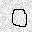
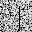

# PR Project

2014011292 李则言

---

## Run

### Requirements:

- python3.5(Anaconda environment is recommanded)
  - pillow
  - numpy
  - scipy
  - tensorflow
  - keras
  - scikit-learn
  - scikit-image
  - dbn(install from https://github.com/albertbup/deep-belief-network, no pypi distribution available)

### Commands

``` python
python3 run_rbm2supervised.py
python3 run_rbm2dbn.py
```

## 数据预处理

这一部分讲的是如何整理给定的数据，得到一个实际用来训练和测试的数据集。

数据预处理包括以下两方面：整理训练数据的标签，去除训练数据和测试数据交叉的部分

这一部分的代码主要在`run_given_data_preprocessing.py`。

### 整理训练数据的标签

给定的训练集中文件标签命名混乱，我希望将其整理为和测试集一样规整的命名格式，以方便查看和读取。

具体的做法为枚举出现过的所有命名规则，如果匹配则重命名并复制到新的目录下

``` python
def rename_given_data_by_label(path_to_input, path_to_output):
    """
    rename the given data to 'idx[digit].*' format
    """
    def copy(src, digit, image_format):
        global idx
        shutil.copy(src, os.path.join(path_to_output, "%d[%s].%s" % (idx, digit, image_format)))
        idx += 1
    if not os.path.exists(path_to_output):
        os.mkdir(path_to_output)
    for entry in os.listdir(path_to_input):
        full_path = os.path.join(path_to_input, entry)
        if os.path.isfile(full_path):
            match = re.match("(?P<digit>\d)_\d+\..*png", entry)
            if match:
                copy(full_path, match.group("digit"), "png")
                continue
            match = re.match("[\d+]\.(?P<digit>\d).*png", entry)
            if match:
                copy(full_path, match.group("digit"), "png")
                continue
            match = re.match("(?P<digit>\d)\.jpg", entry)
            if match:
                copy(full_path, match.group("digit"), "jpg")
                continue
            match = re.match("(?P<digit>\d)\.jpg.*png", entry)
            if match:
                copy(full_path, match.group("digit"), "png")
                continue
            match = re.match("[\d+]-(?P<digit>\d)\.jpg.*png", entry)
            if match:
                copy(full_path, match.group("digit"), "png")
                continue
            match = re.match("[\d+]-(?P<digit>\d)\.jpg", entry)
            if match:
                copy(full_path, match.group("digit"), "jpg")
                continue
            print(full_path)
        elif os.path.isdir(full_path):
            rename_given_data_by_label(full_path, path_to_output)
```


### 去除训练和测试数据重叠的部分

测试集中的100张图片在训练集中也出现过，用这样的测试集测试完全达不到测试和验证的效果。因为这样任何模型只需要尽可能地去拟合训练集即可，不需要有任何的泛化能力，就可以获得尽可能高的正确率。

比如以下的方法得到的正确率都是100%：

- KNN(k=1)
- Decision Tree
- Random Forest

之后提到的所有方法，如果不把训练集中重复的图片去掉，正确率都会高很多，但这是**完全没有意义**的，所以就不展示这类结果了。

去除重复图片的办法很简单，对于训练集中的每张图片，遍历一次测试集，发现有相同的则删除：

``` python
def clean_repeated_train_data(path_train, path_test):
    size = (32, 32)
    test_data, _ = read_data(path_test, size)
    for filename in os.listdir(path_train):
        fullpath = os.path.join(path_train, filename)
        arr = np.asarray(Image.open(fullpath).convert("L").resize(size))
        same = np.count_nonzero(np.sum(np.abs(test_data - np.expand_dims(arr, 0)), axis=(-2, -1)) == 0)
        if same != 0:
            os.remove(fullpath)
            print("remove:", fullpath)
```

## 将RBM作为降维方法

### 思路

RBM作为一个生成式模型，可以从原始数据中提取高层次的抽象的特征，然后再用这些特征输入到其他简单的有监督分类器（比如SVM,Random Forest, Logistic）中进行分类。

这一部分的代码在`run_rbm2supervised.py`中

### 读取数据和处理

1. 大部分图片都是32\*32的灰度图，少部分式RGB图，少部分式35\*35或者其他尺寸的.在读取的时候统一转换为32\*32的灰度图

   ``` python
   image = Image.open(os.path.join(path,    filename)).convert("L").resize(size)
   ```

2. 然后对图片进行降噪处理:

   ``` python
   restoration.denoise_tv_chambolle(arr, weight=0.1)
   ```
   这一步可以让很多噪点变得模糊,从而使得模型更容易学习到数字而不是其他噪声的特征.下面比对几组未降噪和降噪后的结果:

   | 原图                             | 降噪后                                      |
   | ------------------------------ | ---------------------------------------- |
   |    |  |
   |     |  |
   |   |  |
   |     |  |
   |    |  |
   |   |  |
   |    |  |
   |  |  |

   可以看出,进行降噪处理后,从人的感觉出发来看,大部分图片的数字都显眼,都变得更加易于识别.少部分噪声特别严重的图片,提升不是很明显.

3. 这样最后读取到的训练集`shape=(620, 32, 32)`,测试集`shape=(100, 32, 32)`

4. 然后数据扁平化到2维: 

   ``` python
   flatten_train_data = train_data.reshape(np.size(train_data, 0), -1)
   flatten_test_data = test_data.reshape(np.size(test_data, 0), -1)
   ```

   此时训练集`shape=(620, 32 * 32)`,测试集`shape=(100, 32 * 32)`

5. 然后将训练集中的图片分别向上下左右4个方向平移一个像素,最终得到一个5倍大小的训练集.

   ``` python
   flatten_train_data, train_label = nudge_dataset(flatten_train_data, train_label)

   def nudge_dataset(data, label):
       """
       This produces a dataset 5 times bigger than the original one,
       by moving the `size` images in X around by 1px to left, right, down, up
       """
       assert np.ndim(data) is 2
       direction_vectors = [
           [[0, 1, 0],
            [0, 0, 0],
            [0, 0, 0]],

           [[0, 0, 0],
            [1, 0, 0],
            [0, 0, 0]],

           [[0, 0, 0],
            [0, 0, 1],
            [0, 0, 0]],

           [[0, 0, 0],
            [0, 0, 0],
            [0, 1, 0]]]
       data = np.concatenate([data] + [
           np.apply_along_axis(lambda x, w: convolve(x.reshape(IMAGE_SIZE), mode='constant', weights=w).ravel(), 1, data,
                               vector) for vector in direction_vectors])
       label = np.concatenate([label for _ in range(5)], axis=0)
       return data, label
   ```

   ​

   此时训练集`shape=(620 * 5, 32 * 32)`,测试集`shape=(100, 32 * 32)`

6. 再对数据作归一化,归一化到$[0, 1]$上.

   ``` python
   def min_max_normalize(arr: np.ndarray):
       """
       return a normalized copy of arr.
       @:return (arr - min) / (max - min)
       """
       return (arr - np.min(arr, 0)) / (np.max(arr, 0) - np.min(arr, 0) + EPS)
   ```

   ​

### 搭建RBM用于降维

RBM使用一个开源的python库[deep-belief-network](https://github.com/albertbup/deep-belief-network)

- dbn有使用tensorflow实现的子模块dbn.tensorflow,便于使用GPU加速,便于和其他的tensorflow的网络结合
- dbn的接口和sklearn的接口兼容

这样直接调用该模块中就可以搭建一个RBM:

``` python
transformed_size = (32 * 4, 32 * 4, 1)
rbm = BinaryRBM(n_hidden_units=transformed_size[0] * transformed_size[1], activation_function="relu", n_epochs=100, batch_size=32, optimization_algorithm="sgd", learning_rate=1e-3)
rbm.fit(flatten_train_data)
rbm.fit(flatten_test_data)
transformed_train_data = rbm.transform(flatten_train_data)
transformed_test_data = rbm.transform(flatten_test_data)
```

### 使用降维后的数据训练有监督分类器

使用sklearn中的一些模型进行分类:

``` python
####################################################################################################################
# RBM->SVC
####################################################################################################################
evaluate(fit_and_predict(svm.SVC, transformed_train_data, train_label, transformed_test_data, C=128000, cache_size=4096), test_label, "RBM-SVC Classifier")

####################################################################################################################
# RBM->Logistic
####################################################################################################################
evaluate(fit_and_predict(linear_model.LogisticRegression, transformed_train_data, train_label, transformed_test_data, C=400.0), test_label, "RBM-Logistic Classifier")

####################################################################################################################
# RBM->RandomForest
####################################################################################################################
evaluate(fit_and_predict(ensemble.RandomForestClassifier, transformed_train_data, train_label, transformed_test_data, n_estimators=800, max_depth=32), test_label, "RBM-random Forest Classifier")
```

`fit_and_predict`是考虑到sklearn中各种模型接口都是同一个,而写的一个utility函数:

``` python
def fit_and_predict(model_class, train_data, train_label, test_data, **kwargs):
    """
    pipeline fit and predict based on sklearn API
    """
    if np.ndim(train_label) is 1:
        model = model_class(**kwargs)
        model.fit(train_data, train_label)
        return model.predict(test_data)
    else:
        assert np.ndim(train_label) is 2
        d = np.size(train_label, 1)
        result = []
        for i in range(d):
            model = model_class(**kwargs)
            model.fit(train_data, train_label[:, i])
            result.append(np.expand_dims(model.predict(test_data), -1))
        return np.concatenate(result, axis=-1)
```

`evaluate`用来评估分类结果:

``` python
def evaluate(predict: np.ndarray, ground_truth: np.ndarray, indicator: str, report=False):
    assert predict.shape == ground_truth.shape
    if np.ndim(predict) is 2:
        accuracy = np.count_nonzero(np.argmax(predict, axis=-1) == np.argmax(ground_truth, axis=-1)) / np.size(predict,
                                                                                                               0)
    else:
        assert np.ndim(predict) is 1
        accuracy = np.count_nonzero(predict.astype(int) == ground_truth.astype(int)) / np.size(predict)
    if report:
        log("%s:\n" % indicator, metrics.classification_report(predict, predict), "accuracy:", accuracy)
    else:
        log("%s:" % indicator, accuracy)
```

### 降低输入单元数目的尝试

1. 缩放图片。 将图片缩小至更小的大小再输入。

2. 量化图片。原始图片每一个像素用8位表示，其实可以用更少的位数也能识别数字。

   ``` python
   def quantization(arr: np.ndarray, step: int=8) -> np.ndarray:
       return ((arr / step).astype(int) * step).astype(arr.dtype)
   ```

### 结果对比

| Method                                   | Accuracy |
| ---------------------------------------- | -------- |
| RBM(16384, iter=100, lr=0.001)->Logistic(C=400) | 0.83     |
| RBM(16384, iter=100, lr=0.001)->SVC(C=128000) | 0.82     |
| RBM(16384)->RandomForest(n=800, max_depth=32) | 0.76     |
| CNN(conv(64, 3, 3)-conv128(128, 3, 3)-maxpool(2, 2)-dropout(0.25)-dense(128)-dense(10)-dropout(0.5)) | 0.97     |
| MLP(dropout(0.25)-1024-512-dropout(0.5)-10) | 0.84     |
| Logistic(C=4)                            | 0.81     |
| RandomForest(max_depth=38, n=1000)       | 0.63     |
| SVC(C=8000)                              | 0.76     |
| SGD Classifier                           | 0.76     |
| RBM(128, iter=1000, lr=0.001)->Logistic(C=800) | 0.65     |
| RBM(128, iter=1000, lr=0.001)->SVC(C=128000) | 0.47     |
| RBM(576, iter=100, lr=0.001)->Logistic(C=800) | 0.78     |
| RBM(576, iter=100, lr=0.001)->SVC(C=256000) | 0.70     |
| RBM(1024, iter=1000, lr=0.001)->Logistic(C=25600) | 0.82     |
| RBM(1024, iter=1000, lr=0.001)->SVC(C=10000) | 0.75     |
| resize to (24, 24)->RBM(576, iter=100, lr=0.001)->Logistic(C=800) | 0.62     |
| resize to (24, 24)->RBM(576, iter=100, lr=0.001)->SVC(C=1024000) | 0.67     |
| quantization(4)->RBM(576, iter=100, lr=0.001)->Logistic(C=800) | 0.73     |
| quantization(4)->RBM(576, iter=100, lr=0.001)->SVC(C=1024000) | 0.68     |
| quantization(4)->RBM(1024, iter=500, lr=0.001)->Logistic(C=400) | 0.73     |
| quantization(4)->RBM(1024, iter=500, lr=0.001)->SVC(C=140000) | 0.75     |

- 可以看出,当RBM的隐含单元的个数足够多的时候,使用RBM事先做降维都能获得比直接使用某个模型好得多的效果. 这是因为RBM提取出了更加抽象的feature.
- 但是RBM降维+简单的有监督分类器比起CNN和MLP这些神经网络的结果差很多.CNN非常适合这个问题:网络结构不需要很复杂,训练速度很快,只需要很少的迭代次数就可以收敛到最佳的结果,分类的正确率还非常高,而且通过CNN的卷积层的结果可以像生成式模型一样看到提取出的抽象的feature.
- 随着RBM隐含单元数目的减少，正确率逐渐下降，说明RBM在这样的配置和训练次数下已经没有足够的能力充分表达所有信息。
- 缩小图片实际上减少了信息量，所以分类的正确率下降了。但是适当地缩放可以保留足够高的正确率，而且能大大降低训练所用时间。
- 量化图片可以让减少RBM表达全部信息必需的单元个数。

## 搭建DBN，使用RBM做预训练

### 思路

RBM的另一个应用就是在用作深度学习的预训练.对于一个复杂的深度网络,通过对每一层训练一个相同大小的RBM,然后将RBM的权重作为深度网络的初始权重,可以给深度网络一个非常接近最优解的初始权重.也就是说深度网络只需要做fine tuning就可以,更容易收敛到一个最小值点.

DBN处理数据的方式和上面将RBM作为降维方法时是一致的。

搭建DBN使用dbn.tensorflow库.

``` python
dbn = SupervisedDBNClassification(hidden_layers_structure=[4096, 4096], learning_rate_rbm=0.0001, learning_rate=0.001, n_epochs_rbm=200, n_iter_backprop=10000, batch_size=32, activation_function='relu', dropout_p=0.2)
dbn.fit(flatten_train_data, train_label)
evaluate(np.asarray(list(dbn.predict(flatten_test_data))), test_label, "DBN")
```

这一部分的代码在`run_dbn.py`中。

### 结果

1. ​

- DBN Accuracy:0.95

  参数：

  - DBN结构 hidden_layers_structure=[4096, 4096]
  - 预训练学习速率 learning_rate_rbm=0.0001, 
  - 学习速率 learning_rate=0.001, 
  - 预训练迭代次数 n_epochs_rbm=200, 
  - 迭代次数 n_iter_backprop=10000, 
  - batch_size=32, 
  - activation_function='relu', 
  - dropout比例 dropout_p=0.2

  Loss变化曲线:

  

  这个网络训练的速度特别慢.在一台双路TITAN X显卡的服务器上,运行了近8个小时.

2. 减少网络的参数数目

   - DBN Accuracy 0.94

     参数：

     - DBN结构 hidden_layers_structure=[2048, 1024]
     - 预训练学习速率 learning_rate_rbm=0.0001, 
     - 学习速率 learning_rate=0.001, 
     - 预训练迭代次数 n_epochs_rbm=200, 
     - 迭代次数 n_iter_backprop=10000, 
     - batch_size=32, 
     - activation_function='relu', 
     - dropout比例 dropout_p=0.2

   - DBN Accuracy 0.95

     参数：

     - DBN结构 hidden_layers_structure=[512, 512]
     - 预训练学习速率 learning_rate_rbm=0.001, 
     - 学习速率 learning_rate=0.001, 
     - 预训练迭代次数 n_epochs_rbm=50, 
     - 迭代次数 n_iter_backprop=10000, 
     - batch_size=32, 
     - activation_function='relu', 
     - dropout比例 dropout_p=0.2

   - DBN Accuracy 0.86

     参数：

     - DBN结构 hidden_layers_structure=[128, 64]
     - 预训练学习速率 learning_rate_rbm=0.001, 
     - 学习速率 learning_rate=0.001, 
     - 预训练迭代次数 n_epochs_rbm=20, 
     - 迭代次数 n_iter_backprop=10000, 
     - batch_size=32, 
     - activation_function='relu', 
     - dropout比例 dropout_p=0.2

### 预训练有多重要?

再次训练一个模型,相比上面使用的模型(4096*4096),唯一的不同是不使用RBM进行预训练.下面是这次训练的Loss变化曲线.

- DBN Accuracy:0.95

  参数：

  - DBN结构 hidden_layers_structure=[4096, 4096]
  - 预训练学习速率 learning_rate_rbm=0.0001, 
  - 学习速率 learning_rate=0.001, 
  - 预训练迭代次数 n_epochs_rbm=0, 
  - 迭代次数 n_iter_backprop=10000, 
  - batch_size=32, 
  - activation_function='relu', 
  - dropout比例 dropout_p=0.2


可以看出,没有预训练的DBN的Loss在初期下降是很缓慢的,大约经过近1000次迭代之后才开始了和上面fine tuning时一样的Loss下降过程.所以说,使用RBM可以让DBN一开始就从一个接近最优解的地方开始训练,可以大大减少迭代的次数.